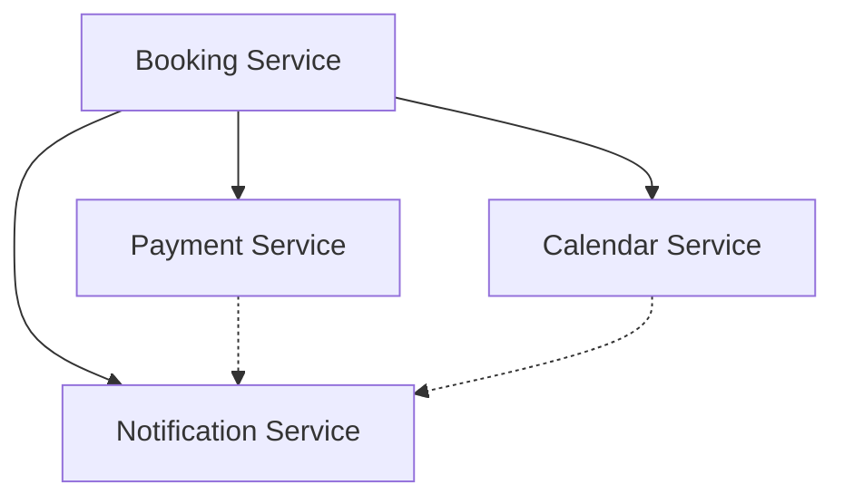

# Service Integration Documentation

## 🔗 Overview

This document describes how the microservices in the booking system are integrated to provide a complete end-to-end workflow.

## 📊 Integration Architecture

```
┌─────────────┐
│   CLIENT    │
└──────┬──────┘
       │
       ▼
┌─────────────────────────────────────────────────┐
│          Booking Service (Port 8082)            │
│  ┌──────────────────────────────────────────┐   │
│  │  1. Create Booking (PENDING)             │   │
│  │  2. Send Booking Confirmation Email      │───┼──► Notification Service
│  └──────────────────────────────────────────┘   │         (Port 8085)
│                    │                             │
│                    ▼                             │
│  ┌──────────────────────────────────────────┐   │
│  │  3. Confirm Booking (CONFIRMED)          │   │
│  └──────────────────────────────────────────┘   │
│                    │                             │
│                    ├──────────────────┬──────────┤
│                    ▼                  ▼          ▼
│           ┌───────────────┐  ┌──────────────┐  ┌──────────────┐
│           │  Payment      │  │  Calendar    │  │ Notification │
│           │  Service      │  │  Service     │  │  Service     │
│           │  (8083)       │  │  (8084)      │  │  (8085)      │
│           └───────────────┘  └──────────────┘  └──────────────┘
│                    │                  │                │
│                    ▼                  ▼                ▼
│           Create Payment     Create Calendar    Send Notifications:
│           Checkout Session   Event (Mock)       - Payment Confirmation
│           (Stripe Mock)                         - Calendar Event Created
│
└─────────────────────────────────────────────────┘
```

## 🔄 Workflow Steps

### 1. Create Booking

**Endpoint:** `POST /api/bookings`

**Request:**

```json
{
  "facilityId": 1,
  "startTime": "2026-06-15T10:00:00",
  "endTime": "2026-06-15T12:00:00",
  "notes": "Team practice"
}
```

**What happens:**

1. ✅ Booking created with status `PENDING`
2. ✅ Booking confirmation notification sent (EMAIL)

---

### 2. Confirm Booking

**Endpoint:** `PATCH /api/bookings/{id}/status`

**Request:**

```json
{
  "status": "CONFIRMED"
}
```

**What happens:**

1. ✅ Booking status changed to `CONFIRMED`
2. ✅ **Payment Service** - Payment checkout session created (Stripe Mock)
3. ✅ **Calendar Service** - Google Calendar event created (Mock)
4. ✅ **Notification Service** - Payment confirmation email sent
5. ✅ **Notification Service** - Calendar event notification sent

---

### 3. Cancel Booking

**Endpoint:** `DELETE /api/bookings/{id}`

**What happens:**

1. ✅ Booking status changed to `CANCELLED`
2. ✅ Booking cancellation notification sent (EMAIL)

---

## 🛠️ Technical Implementation

### Booking Service Integration

**Dependencies:**

```xml
<dependency>
    <groupId>org.springframework.boot</groupId>
    <artifactId>spring-boot-starter-webflux</artifactId>
</dependency>
```

**Configuration (`application.properties`):**

```properties
services.payment.url=http://localhost:8083/api/payments
services.calendar.url=http://localhost:8084/api/calendar
services.notification.url=http://localhost:8085/api/notifications
```

**Client Classes:**

- `PaymentClient.java` - HTTP client for Payment Service
- `CalendarClient.java` - HTTP client for Calendar Service
- `NotificationClient.java` - HTTP client for Notification Service

**Service Integration Points:**

1. **`createBooking()`**

   - Sends booking confirmation notification via `NotificationClient`

2. **`updateBookingStatus()` (PENDING → CONFIRMED)**

   - Triggers `handleBookingConfirmed()`
   - Creates payment checkout session via `PaymentClient`
   - Creates calendar event via `CalendarClient`
   - Sends payment confirmation notification
   - Sends calendar event notification

3. **`cancelBooking()`**
   - Sends booking cancellation notification via `NotificationClient`

---

## 📝 Example: Complete Integration Flow

### Step 1: Create Booking

```bash
curl -X POST http://localhost:8082/api/bookings \
  -H "Content-Type: application/json" \
  -H "X-User-Id: 123" \
  -d '{
    "facilityId": 5,
    "startTime": "2026-06-15T10:00:00",
    "endTime": "2026-06-15T12:00:00",
    "notes": "Full integration test"
  }'
```

**Response:**

```json
{
  "id": 1,
  "userId": 123,
  "facilityId": 5,
  "status": "PENDING",
  "totalPrice": 30.00,
  ...
}
```

**Side Effects:**

- ✅ Notification #1 created: `BOOKING_CONFIRMATION` (EMAIL, MOCK)

---

### Step 2: Confirm Booking

```bash
curl -X PATCH http://localhost:8082/api/bookings/1/status \
  -H "Content-Type: application/json" \
  -H "X-User-Id: 123" \
  -d '{"status": "CONFIRMED"}'
```

**Response:**

```json
{
  "id": 1,
  "status": "CONFIRMED",
  ...
}
```

**Side Effects:**

- ✅ Payment #1 created (status: PENDING, sessionId: cs_mock_xxx)
- ✅ Calendar Event #1 created (status: MOCK, googleEventId: mock_xxx)
- ✅ Notification #2 created: `PAYMENT_CONFIRMATION` (EMAIL, MOCK)
- ✅ Notification #3 created: `EVENT_REMINDER` (EMAIL, MOCK)

---

### Step 3: Verify Integration

**Check Payment:**

```bash
curl http://localhost:8083/api/payments/booking/1
```

**Check Calendar Event:**

```bash
curl http://localhost:8084/api/calendar/events/booking/1
```

**Check Notifications:**

```bash
curl http://localhost:8085/api/notifications/booking/1
```

---

## 🧪 Testing Integration

### PowerShell Test Script

```powershell
# 1. Create Booking
$booking = Invoke-RestMethod -Uri "http://localhost:8082/api/bookings" `
  -Method POST `
  -Headers @{"Content-Type"="application/json"; "X-User-Id"="123"} `
  -Body '{"facilityId": 5, "startTime": "2026-06-15T10:00:00", "endTime": "2026-06-15T12:00:00", "notes": "Test"}'

Write-Host "Booking created: ID=$($booking.id)"

# 2. Confirm Booking
$confirmed = Invoke-RestMethod `
  -Uri "http://localhost:8082/api/bookings/$($booking.id)/status" `
  -Method PATCH `
  -Headers @{"Content-Type"="application/json"; "X-User-Id"="123"} `
  -Body '{"status": "CONFIRMED"}'

Write-Host "Booking confirmed"

# Wait for integrations
Start-Sleep -Seconds 5

# 3. Check Payment
$payment = Invoke-RestMethod `
  -Uri "http://localhost:8083/api/payments/booking/$($booking.id)"

Write-Host "Payment: $($payment.id) - Status: $($payment.status)"

# 4. Check Calendar
$calendar = Invoke-RestMethod `
  -Uri "http://localhost:8084/api/calendar/events/booking/$($booking.id)"

Write-Host "Calendar Event: $($calendar.id) - Status: $($calendar.status)"

# 5. Check Notifications
$notifications = Invoke-RestMethod `
  -Uri "http://localhost:8085/api/notifications/booking/$($booking.id)"

Write-Host "Notifications: $($notifications.Count) sent"
$notifications | Select-Object type, status | Format-Table
```

---

## ⚙️ Mock Mode

All external integrations run in **mock mode** by default for development/testing:

| Service          | Mock Mode                                  |
| ---------------- | ------------------------------------------ |
| **Payment**      | Stripe API calls replaced with mock data   |
| **Calendar**     | Google Calendar API calls return mock data |
| **Notification** | Emails logged to console instead of SMTP   |

**Configuration:**

- Payment: `stripe.mock-mode=true`
- Calendar: `google.calendar.mock-mode=true`
- Notification: `notification.mock-mode=true`

---

## 🔧 Error Handling

All inter-service calls use **graceful degradation**:

- If Payment Service fails → Booking still confirmed, payment error logged
- If Calendar Service fails → Booking still confirmed, calendar error logged
- If Notification Service fails → Booking still confirmed, notification error logged

**Rationale:** External service failures shouldn't break core booking functionality.

---

## 📦 Service Dependencies



**Legend:**

- `→` Direct dependency
- `-.->` Optional callback (not implemented yet)

---

## 🚀 Future Enhancements

1. **Async Processing**

   - Use message queue (RabbitMQ/Kafka) for inter-service communication
   - Retry mechanism for failed integrations

2. **Webhooks**

   - Payment Service calls back Booking Service on payment completion
   - Calendar Service sends event reminders

3. **Service Discovery**

   - Use Eureka or Consul for dynamic service registration
   - Load balancing with multiple instances

4. **API Gateway**

   - Single entry point for all services
   - Authentication & rate limiting

5. **Circuit Breaker**
   - Use Resilience4j to prevent cascading failures
   - Fallback strategies for service outages

---

## 📚 Related Documentation

- [Booking Service API](../services/booking-service/API_DOCUMENTATION.md)
- [Payment Service README](../services/payment-service/README.md)
- [Calendar Service README](../services/calendar-service/README.md)
- [Notification Service README](../services/notification-service/README.md)

---

## 🎯 Summary

**Integrated Services:** 4 (Booking, Payment, Calendar, Notification)

**Integration Points:** 5

1. Create Booking → Send Notification
2. Confirm Booking → Create Payment
3. Confirm Booking → Create Calendar Event
4. Confirm Booking → Send Payment Notification
5. Confirm Booking → Send Calendar Notification
6. Cancel Booking → Send Cancellation Notification

**Status:** ✅ Basic integration working (Payment creation successful, Notification partially working)

**Known Issues:**

- Calendar event creation needs validation fixes
- Some notifications not being sent (under investigation)
- Payment completion callback not implemented yet
